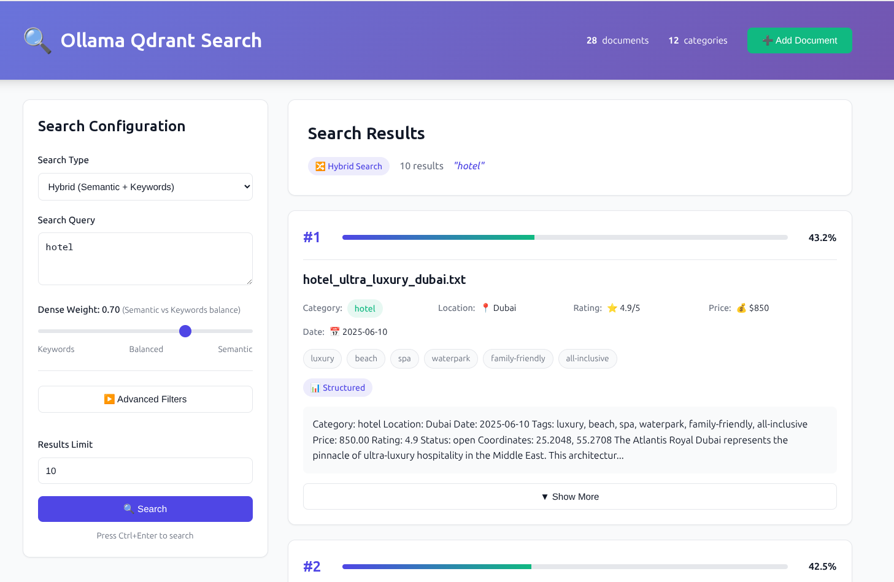
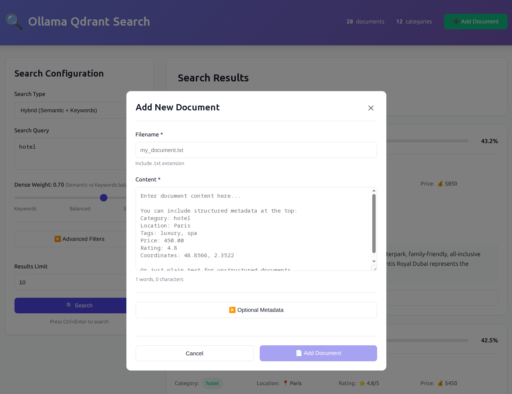

# Web UI

Modern web interface for the Ollama-Qdrant vector search experiment.

## Screenshots

### Main Search Interface



The main interface features:
- Multiple search types (Semantic, Hybrid, Location, Geo-radius)
- Advanced filtering options
- Real-time results with score indicators
- Document count and category statistics

### Add Document Modal



Upload new documents directly from the browser:
- **Text Input**: Direct content entry with optional metadata
- **File Upload**: Support for multiple formats (TXT, JSON, PDF, DOCX, DOC)
- Real-time word/character count
- Instant embedding and indexing
- Automatic metadata extraction from file content

## Features

- **Multiple Search Types**
  - Semantic search (dense vectors)
  - Hybrid search (semantic + keywords)
  - Location-based search
  - Geo-radius search

- **Advanced Filtering**
  - Category filter
  - Price range
  - Minimum rating
  - Tags matching
  - Document type (structured/unstructured)

- **Beautiful UI**
  - Real-time search
  - Visual score indicators
  - Expandable result cards
  - Responsive design
  - Dark-mode ready

## Technology Stack

- **Frontend**: Vue 3 (Composition API) + Vite
- **Backend**: Express.js API server
- **Styling**: Custom CSS with modern design system

## Quick Start

From the root directory:

```bash
# Install dependencies
npm install
cd web-ui && npm install && cd ..

# Start the web UI (both API and frontend)
npm run webui
```

Or use the startup script directly:

```bash
./start-webui.sh
```

The script will:
1. Check that Qdrant and Ollama are running
2. Install dependencies if needed
3. Start the API server on port 3001
4. Start the Vue dev server on port 5173
5. Open your browser to http://localhost:5173

## Manual Start

If you prefer to start services separately:

### Terminal 1 - API Server
```bash
npm run server
# or: node server.js
```

### Terminal 2 - Vue UI
```bash
cd web-ui
npm run dev
```

## API Endpoints

The Express server provides these endpoints:

- `GET /api/health` - Health check
- `GET /api/stats` - Collection statistics
- `POST /api/search/semantic` - Semantic search
- `POST /api/search/hybrid` - Hybrid search
- `POST /api/search/location` - Location-based search
- `POST /api/search/geo` - Geo-radius search
- `POST /api/documents/add` - Add document (text input)
- `POST /api/documents/upload` - Upload document file

## Document Upload

The web UI supports uploading documents in multiple formats:

### Supported File Formats

- **TXT**: Plain text files
- **JSON**: Structured data with optional metadata fields
- **PDF**: Extracts text content and page count
- **DOCX**: Microsoft Word documents (modern format)
- **DOC**: Microsoft Word documents (legacy format - best effort)

### Upload Methods

**Method 1: Text Input**
1. Click "Add Document" button
2. Select "Text Input" mode
3. Enter filename and content
4. Add optional metadata (category, location, tags, etc.)
5. Click Upload

**Method 2: File Upload**
1. Click "Add Document" button
2. Select "File Upload" mode
3. Choose file (max 10MB)
4. Optionally add/override metadata
5. Click Upload

### Metadata Extraction

The system automatically extracts metadata from file content:
- **Category**: Hotel, restaurant, attraction, technology, etc.
- **Location**: City names and geographic references
- **Tags**: Keywords and descriptive terms
- **Ratings**: Numerical ratings (0-5 scale)
- **Prices**: Price information
- **Coordinates**: Latitude/longitude if present

You can also manually specify metadata which will override automatic extraction.

## Project Structure

```
web-ui/
├── src/
│   ├── App.vue              # Main application component
│   ├── main.js              # Vue app entry point
│   ├── style.css            # Global styles
│   ├── api.js               # API client
│   └── components/
│       ├── SearchForm.vue   # Search configuration form
│       └── ResultsList.vue  # Results display
├── index.html               # HTML entry point
├── vite.config.js           # Vite configuration
└── package.json             # Dependencies

server.js                    # Express API server (root)
start-webui.sh              # Startup script (root)
```

## Development

### Hot Reload

Both the API server and Vue UI support hot reload during development:

- API changes: Restart `npm run server`
- UI changes: Automatically reloaded by Vite

### Adding Features

**New Search Type:**
1. Add endpoint in `server.js`
2. Add option in `SearchForm.vue`
3. Handle response in `App.vue`

**New Filter:**
1. Add form field in `SearchForm.vue`
2. Include in `buildFilters()` function
3. Server automatically handles it

### Customization

**Colors/Theme:**
Edit CSS variables in `web-ui/src/style.css`:

```css
:root {
  --primary-color: #4f46e5;
  --secondary-color: #10b981;
  /* ... */
}
```

**API Port:**
Change in `server.js` and `web-ui/vite.config.js`

**UI Port:**
Change in `web-ui/vite.config.js`

## Troubleshooting

### "API server failed to start"
- Check that port 3001 is available
- Ensure Qdrant is running on port 6333
- Verify `.env` file configuration

### "Cannot connect to API"
- Check browser console for errors
- Verify API server is running: `curl http://localhost:3001/api/health`
- Check CORS settings in `server.js`

### "No results found"
- Ensure documents are embedded: `npm run embed`
- Check collection exists in Qdrant dashboard
- Verify search query syntax

## Production Build

To build for production:

```bash
cd web-ui
npm run build
```

This creates optimized static files in `web-ui/dist/`.

You can serve them with any static file server or integrate with the Express server.

## Browser Support

- Chrome/Edge 90+
- Firefox 88+
- Safari 14+

## License

MIT
